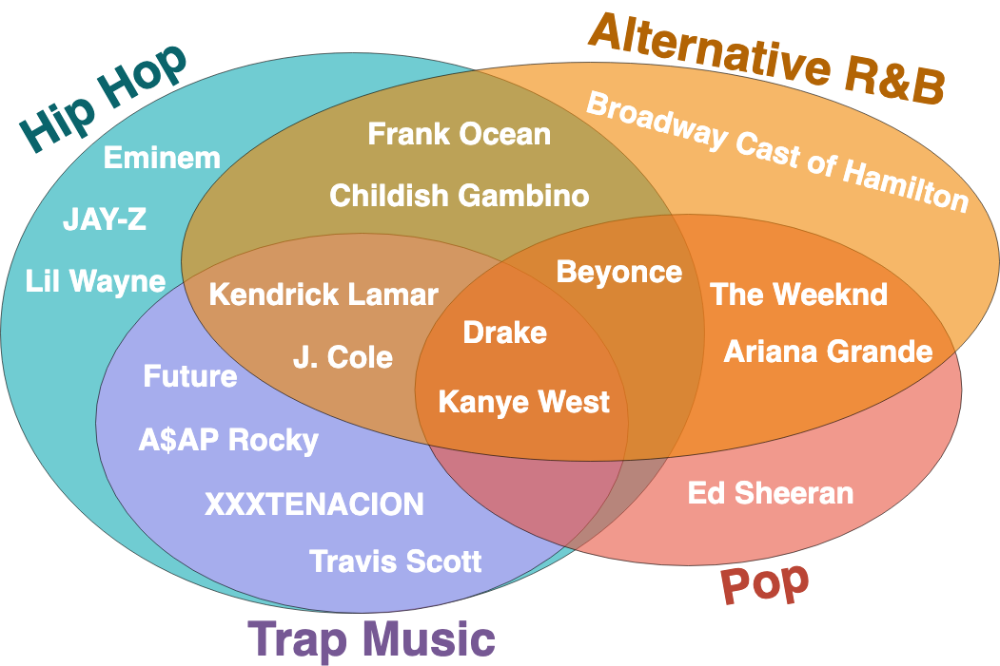
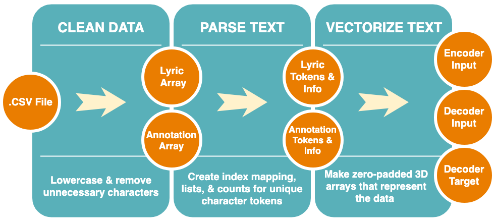
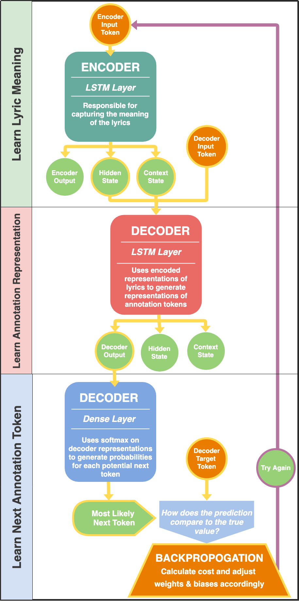
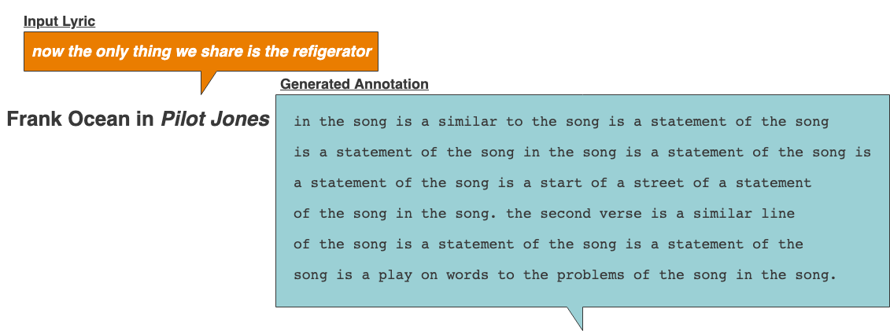
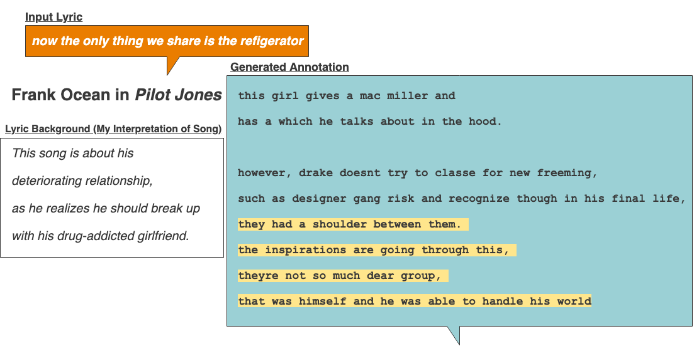

# Neural Machine Translation: Explaining The Meaning Behind Lyrics

### Generating Lyric Explanations with Seq2Seq LSTMs

*by Taite Sandefer* | *Capstone III Project for Galvanize DSI, Week 12*

*App Coming Soon!* | *Last Updated: 5/4/19* | *Please refer to [Capstone Showcase Poster](taite_sandefer_capstone_project_poster.pdf) for additional info*

## Table of Contents
- [Introduction](#introduction)
  - [Background](#background)
  - [Product](#product)
  - [Tech Stack](#tech-stack)
- [Data Overview](#data-overview)
  - [Preparation](#preparation)
- [Seq2Seq LSTMs](#seq2seq-lstms)
  - [Model Architecture](#model-architecture)
- [Results](#results)
- [Acknowledgements](#acknowledgements)

# Introduction
## Background
### What is Genius?
[Genius](https://genius.com/), formerly "Rap Genius," is a website where users can view and add annotations to lyrics that help explain their meaning and context.

  

The primary goal of Genius is to explain lyrics and help make them more accessible to listeners. Generally, these are explanations regarding the semantic and/or cultural meanings behind lyrics, which can often cryptic and filled with linguistic subtleties that we wouldn't normally expect a computer to be able to pick up on.

  

## Product
When I was developing the application for this model for users to demo during the Capstone Showcase, it seemed like a good idea to start branding this product. I picked a name and crafted a logo that I felt represented my mission for this project. 

  

  

### Kairoi
Kairoi is the plural form of [Kairos](https://en.wikipedia.org/wiki/Kairos), a rhetorical term that describes a speaker's ability to adapt to and take advantage of changing, contingent circumstance. To the ancient Greeks, Kairos was the god of opportunity and the fleeting moment.

> "Running swiftly, balancing on the razor's edge, bald but with a lock of hair on his forehead, he wears no clothes; if you grasp him from the front, you might be able to hold him, but once he has moved on not even Zeus himself can pull him back: this is a symbol of Kairos, the brief moment in which things are possible." - Aesop, [Fables 536 (from Phaedrus 5. 8)](https://www.theoi.com/Daimon/Kairos.html)

In NLP, text is often treated like a sequential time-series problem. Many of today's tools use frequentist statistical practices to identify patterns that tend to capture syntax more than semantic meaning. State of the art tools, like Seq2Seq and Attention Mechanisms, focus on finding the right sequential patterns in text, which is why they embody the qualitative and subjective concept of time that the word Kairos represents.

## Tech Stack 
- AWS EC2
- Flask
- Docker
- Tensorflow
- Keras
- SKLearn
- NumPy
- Pandas
- Matplotlib

# Data Overview
## Genius' Top 20 Artists 
Okay, okay... Technically, 19 artists. Searching for annotations from Nicki Minaj's work was unsuccessful, and since I already had ~10k pairs of data from other artists, I decided to cut my losses. 

  

## Preparation

  

# Seq2Seq LSTMs

## Model Architecture
> "Specifically, an NMT system first reads the source sentence using an encoder to build a "thought" vector, a sequence of numbers that represents the sentence meaning; a decoder, then, processes the sentence vector to emit a translation, as illustrated in Figure 1. This is often referred to as the encoder-decoder architecture. In this manner, NMT addresses the local translation problem in the traditional phrase-based approach: it can capture long-range dependencies in languages, e.g., gender agreements; syntax structures; etc., and produce much more fluent translations as demonstrated by Google Neural Machine Translation systems."

### Training Phase

  

### Inference and Generation Phase

  

### Sampling with Diversity
When selecting from the pool of potential characters during generation, we use a method called "sampling with diversity" that helps introduce some randomness back into the equation. Language is self-similar in that we often see repeating patterns in our words (and characters!), but true natural language these patterns in ways that are slightly transformed each time they are reflected. Music, images, and art tend to be highly self-similar as well. 

Think: the swirls in Vincent Van Goh's <i>Starry Night</i>, which are similar to each other, but not exactly the same. 

That's why they're beautiful. And that's also part of what makes NLP such an interesting and challenging problem. It's easy to write an algorithm that replicate patterns over and over again -- but it's much more difficult to develop one that can execute slight transformations on those patterns in the way that the human mind so naturally does. 

Alright, back to sampling with diversity. So, basically, we're not just picking the most likely character. Instead, we randomly sample from the probability distribution of possible characters. The most likely character is still the most likely, but this gives us a chance of picking something else. We then change this distribution by turning the diversity temperature higher or lower, which either evens out the playing field or makes the most likely characters even more likely. 

Here's a quick diagram to give you an idea of what that looks like:

  

# Results
## Examples (So Far)

  
   
  

# Future Work & Improvements
## Performance Evaluation
Evaluating performance for a task like this isn't easy on a large scale. While we do care, to some degree, about the model's ability to <i>accurately</i> predict the exact next character, what we really care about is that it produces a cohesive sequence of characters that not only follow the syntax that we're familiar with, but also is able to <i>explain</i> the input lyrics, like a human might. So, although model accuracy and categorical cross-entropy play a role, they're probably not what we're looking for in a measure of whether the model is actually performing well or not. (See about [self-similarity](#sampling-with-diversity) in section above)

Recent research projects have used a measure called the [BLEU score](https://www.aclweb.org/anthology/P02-1040.pdf). However, my [Capstone II project](https://github.com/tsandefer/dsi_capstone_2) focused on creating a system for evaluating lyrics and annotations, which was intended to be used to measure performance in this phase of the project. Although I have not yet implemented this part of the project, partially because of issues in the data itself and difficulty measuring the performance of the evaluation system itself, it is certainly the most important next step in this project. 

- BLEU score
> "More importantly, the performance of the RNNsearch is as high as that of the conventional phrase-based
translation system (Moses), when only the sentences consisting of known words are considered."
- [BLEU Score paper](https://www.aclweb.org/anthology/P02-1040.pdf)

### Secret Sauce: Attention Mechanism
> "The key idea of the attention mechanism is to establish direct short-cut connections between the target and the source by paying "attention" to relevant source content as we translate. A nice byproduct of the attention mechanism is an easy-to-visualize alignment matrix between the source and target sentences (as shown in Figure 4)."

- [Bahdanau et al., 2015](https://arxiv.org/abs/1409.0473)
- [Luong et al., 2015](https://arxiv.org/abs/1508.04025)

# Acknowledgements
Many, many thanks to all of those who have been a part of this journey with me!

- [Genius.com](https://genius.com/)
- DSI instructors: Frank Burkholder, Danny Lumian, Kayla Thomas
- Cohort Peers working with NLP: Matt Devor, Aidan Jared, Lei Shan
- johnwmillr's [LyricsGenius](https://github.com/johnwmillr/LyricsGenius)
- [TensorFlow's Seq2Seq](https://github.com/tensorflow/nmt)

