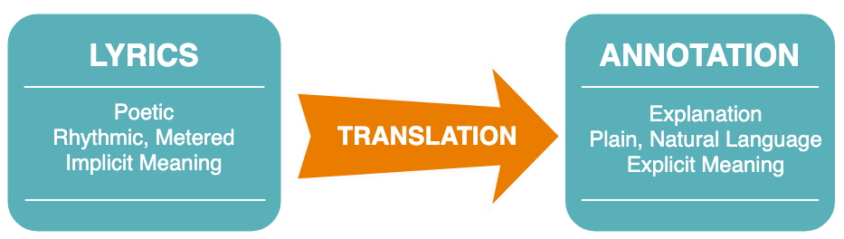
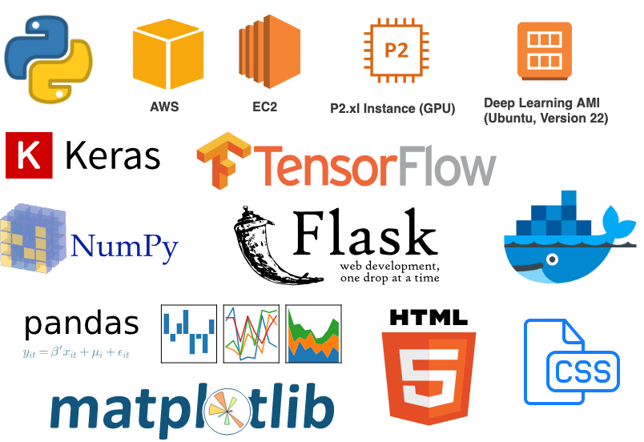

  

*Last Updated: 5/8/19* | *[Capstone Showcase Poster](taite_sandefer_capstone_project_poster.pdf)*

## Check out [the Kairoi App](https://kairoi-flask-app.herokuapp.com/), deployed via Heroku!

### Application MVP:
- [x] Build Basic Flask App with HTML and CSS
- [x] Add functionality to translate lyrics
- [x] Create Cohesive Brand
  - [x] Cohesive color & style
  - [x] Design Logo
  - [x] Pick meaningful name
  - [x] Write mission statement
- [x] Add links to GitHub and contact info
- [x] Functioning menu bar
- [x] Additional choices and functionality for explaining lyrics
  - [x] Different models
  - [x] Diversity Temperature slider
  - [x] Sample lyric dropdown
  - [x] User-input lyrics
- [x] Deploy app via Heroku

### Application Next Steps:
- [ ] Customize domain name 
- [ ] Formatting of "Explain Lyrics" page
- [ ] Have Diversity Temperature slider show range or current value
- [ ] Contact form
- [ ] General spacing and alignment of pages
- [ ] Use trained Doc2Vec model (from Capstone II) to evaluate generated explanation
- [ ] Use t-SNE to visualize the difference between the generated explanation and the currently published one
- [ ] Give option for user to rate quality of generated explanation
- [ ] Carousel page of "Best Explanations", populated by the top 30%
- [ ] Add options to use more advanced models (Training in progress!) 
  - [ ] Seq2Seq with Bidirectional LSTMs
  - [ ] Seq2Seq with Attention Decoder (use transfer learning with pre-trained character or word embeddings)
  - [ ] Transformer Model (Fully Attention-Based)

## Table of Contents
- [Introduction](#introduction)
  - [Background](#background)
  - [Product](#product)
  - [Tech Stack](#tech-stack)
- [Data Overview](#data-overview)
  - [Preparation](#preparation)
- [Seq2Seq LSTMs](#seq2seq-lstms)
  - [Model Architecture](#model-architecture)
- [Results](#results)
- [Acknowledgements](#acknowledgements)

# Introduction
## Background
### Motivation 
As a rhetoric student, I wanted to further explore how neural networks could pick up on the more subtle semantic patterns in natural language. However, one of the main challenges in NLP is a lack of labeled data, especially in regard to something like [pragmatics](https://en.wikipedia.org/wiki/Pragmatics) (the study of meaning, with respect to goals and intentions). 

Luckily, I remembered a website that I had used in an experimental high school English class. My teacher frequently utilized [Genius.com](https://genius.com/) for close reading assignments in our class, where he would post exerpts from Shakespeare or The Great Gatsby, and students would "annotate" selections from the passages by highlighting them and explaining their literary functions. Here's [an example of one of my annotations](https://genius.com/1078024) from way back in high school, if you're interested!

I always loved close reading, and thought it was a great way to develop a deeper understanding of a text. Could I develop an algorithm that could close read, like we do? 

Genius.com wasn't initially intended to be a site for English class close reading. It was even called "Rap Genius" at the time because it was meant to be a community where users could read and contribute these annotations to explain rap lyrics. 

### What is Genius?
[Genius](https://genius.com/) is an online community where users browse, rate, and create annotations for lyrics to help explain their meaning and context.

  

The primary goal of Genius is to explain lyrics and help make them more accessible to listeners. Generally, these are explanations regarding the semantic and/or cultural meanings behind lyrics, which can often cryptic and filled with linguistic subtleties that we wouldn't normally expect a computer to be able to pick up on.

  

This is effectively a dataset of labeled meaning, if we can assume that these crowdsourced annotations tend to truly "explain" the meaning behind their respective lyrics. Just like any real-world dataset, this assumption might be a stretch, since plenty of these annotations go off on unrelated tangents or focus on cultural context that isn't generalizable.

Although this dataset is far from ideal, it still might be useful in training a model that can explain user-input lyrics. So let's give it a try!

### Neural Machine Translation 
The semantic and contextual similarity between these lyrics and their annotations allows us to view this as a translation problem. In recent years, the Seq2Seq model architecture has had a successful track record in translation tasks, such as this one. 

Can a Seq2Seq LSTM model use the linguistic patterns in the data to learn how to explain lyrics? 

  

## Product
When I was developing the application for this model for users to demo during the Capstone Showcase, it seemed like a good idea to start branding this product. I picked a name and crafted a logo that I felt represented my mission for this project. 

  

  

### Kairoi
Kairoi is the plural form of [Kairos](https://en.wikipedia.org/wiki/Kairos), a rhetorical term that describes a speaker's ability to adapt to and take advantage of changing, contingent circumstance. To the ancient Greeks, Kairos was the god of opportunity and the fleeting moment.

> "Running swiftly, balancing on the razor's edge, bald but with a lock of hair on his forehead, he wears no clothes; if you grasp him from the front, you might be able to hold him, but once he has moved on not even Zeus himself can pull him back: this is a symbol of Kairos, the brief moment in which things are possible." - Aesop, [Fables 536 (from Phaedrus 5. 8)](https://www.theoi.com/Daimon/Kairos.html)

In NLP, text is often treated like a sequential time-series problem. Many of today's tools use frequentist statistical practices to identify patterns that tend to capture syntax more than semantic meaning. State of the art tools, like Seq2Seq and Attention Mechanisms, focus on finding the right sequential patterns in text, which is why they embody the qualitative and subjective concept of time that the word Kairos represents.

## Tech Stack 

  

# Data Overview
## Genius' Top 20 Artists 

I ended up pulling in a total of 9,828 lyric-annotation pairs from the [Genius.com API](https://docs.genius.com/) that came from the most popular songs of the top 20 artists on Genius. These artists are mostly from hip-hop subgenres. 

  

Okay, okay... Technically, 19 artists. Querying the API for annotations from Nicki Minaj's work was not immediately successful. Since I already had ~10k pairs of data from other artists, and only two weeks to do this project, I decided to move forward. 

## Preparation

  

Similarly to other examples of NMT, I decided not to stem or lemmatize my text. Instead, I lowercased the text, which reduced the number of potential tokens by 26 for the input and target vectors. I also decided to strip out anything that wasn't a letter, number, space, newline character, or one of my chosen punctuation characters. 

Upon my first go-round, I found that there were nearly 200 potential characters for both lyric and annotation texts, due to some strange non-ASCII characters being introduced. After some investigation, I found that these characters were fairly rare, and didn't add much to the texts when they occurred. So I decided to simply strip them out, rather than keeping them (which would increase dimensionality unnecessarily) or dropping the rows entirely (which would reduce the dataset by about 1k examples, even though there were only one or two strange characters in these examples that didn't add much to the meaning of the text). 

# Seq2Seq LSTMs
## Model Architecture
> "Specifically, an NMT system first reads the source sentence using an encoder to build a "thought" vector, a sequence of numbers that represents the sentence meaning; a decoder, then, processes the sentence vector to emit a translation, as illustrated in Figure 1. This is often referred to as the encoder-decoder architecture. In this manner, NMT addresses the local translation problem in the traditional phrase-based approach: it can capture long-range dependencies in languages, e.g., gender agreements; syntax structures; etc., and produce much more fluent translations as demonstrated by Google Neural Machine Translation systems."

### Training Phase
The model was trained on an AWS EC2 p2.xl instance, which had GPU that reduced training time from +100 hours to only 6 hours for 100 epochs and a batch size of 64.

  

### Inference and Generation Phase

  

### Sampling with Diversity
When selecting from the pool of potential characters during generation, we use a method called "sampling with diversity" that helps introduce some randomness back into the equation. Language is self-similar in that we often see repeating patterns in our words (and characters!), but true natural language these patterns in ways that are slightly transformed each time they are reflected. Music, images, and art tend to be highly self-similar as well. 

Think: the swirls in Vincent Van Goh's <i>Starry Night</i>, which are similar to each other, but not exactly the same. 

That's why they're beautiful. And that's also part of what makes NLP such an interesting and challenging problem. It's easy to write an algorithm that replicate patterns over and over again -- but it's much more difficult to develop one that can execute slight transformations on those patterns in the way that the human mind so naturally does. 

Alright, back to sampling with diversity. So, basically, we're not just picking the most likely character. Instead, we randomly sample from the probability distribution of possible characters. The most likely character is still the most likely, but this gives us a chance of picking something else. We then change this distribution by turning the diversity temperature higher or lower, which either evens out the playing field or makes the most likely characters even more likely. 

Here's a quick diagram to give you an idea of what that looks like:

  

# Results
I've found, by reading through many generated explanations, is that this model tends to perform best when we use a sampling with diversity temperature between 0.5 and 0.75, meaning that the most likely characters become a little more likely. In other words, the distribution that we're picking from is slightly less diverse. 

I've noticed that the model trained with 256 latent dimensions tends to generate explanations that syntactically make sense, but don't quite connect with the lyrics they're explaining. However, the model with 512 latent dimensions does tend to reflect words and phrases that better connect with their respective lyrics, but aren't grammatically coherent. This seems to be consistent with the idea that the less complex model is picking up on less complex patterns (syntax), while the more complex model loses that signal but is able to better connect with context. 

I'll also note that the model isn't very discerning when it comes to the names of the artists. Generally, it uses the names of artists in the same genre to refer to the speaker of the lyrics, but it seems that it might just be repeating names it's repeatedly heard (not necessarily due to similarity across artists) due to the fact the vast majority of these lyrics could be considered to be hip hop.

## Examples (So Far)

  
   
  

# Future Work & Improvements
## Performance Evaluation
Evaluating performance for a task like this isn't easy on a large scale. While we do care, to some degree, about the model's ability to <i>accurately</i> predict the exact next character, what we really care about is that it produces a cohesive sequence of characters that not only follow the syntax that we're familiar with, but also is able to <i>explain</i> the input lyrics, like a human might. So, although model accuracy and categorical cross-entropy play a role, they're probably not what we're looking for in a measure of whether the model is actually performing well or not. (See about [self-similarity](#sampling-with-diversity) in section above)

Recent research projects have used a measure called the [BLEU score](https://www.aclweb.org/anthology/P02-1040.pdf). However, my [Capstone II project](https://github.com/tsandefer/dsi_capstone_2) focused on creating a system for evaluating lyrics and annotations, which was intended to be used to measure performance in this phase of the project. Although I have not yet implemented this part of the project, partially because of issues in the data itself and difficulty measuring the performance of the evaluation system itself, it is certainly the most important next step in this project. 

- BLEU score
> "More importantly, the performance of the RNNsearch is as high as that of the conventional phrase-based
translation system (Moses), when only the sentences consisting of known words are considered."
- [BLEU Score paper](https://www.aclweb.org/anthology/P02-1040.pdf)

### Secret Sauce: Attention Mechanism
> "The key idea of the attention mechanism is to establish direct short-cut connections between the target and the source by paying "attention" to relevant source content as we translate. A nice byproduct of the attention mechanism is an easy-to-visualize alignment matrix between the source and target sentences (as shown in Figure 4)."

- [Bahdanau et al., 2015](https://arxiv.org/abs/1409.0473)
- [Luong et al., 2015](https://arxiv.org/abs/1508.04025)

# Acknowledgements
Many, many thanks to all of those who have been a part of this journey with me!

- [Genius.com](https://genius.com/)
- DSI instructors: Frank Burkholder, Danny Lumian, Kayla Thomas
- Cohort Peers working with NLP: [Matt Devor](https://github.com/MattD82), [Lei Shan](https://github.com/slme1109), [Aiden Jared](https://github.com/Aidan-Jared)
- Galvanize Alumni
  - [Erin Desmond's ABC Music](https://github.com/erindesmond/ABC-MUSIC)
- johnwmillr's [LyricsGenius](https://github.com/johnwmillr/LyricsGenius)

## Tutorials Used
- [Seq2Seq with Keras](https://blog.keras.io/a-ten-minute-introduction-to-sequence-to-sequence-learning-in-keras.html)
- [TensorFlow's Seq2Seq](https://github.com/tensorflow/nmt)

## Helpful Blogs 
- [Seq2Seq: The Clown Car of Deep Learning, by Dev Nag](https://medium.com/@devnag/seq2seq-the-clown-car-of-deep-learning-f88e1204dac3)
- [How to Define an Encoder-Decoder Sequence-to-Sequence Model for Neural Machine Translation in Keras by Jason Brownlee](https://machinelearningmastery.com/define-encoder-decoder-sequence-sequence-model-neural-machine-translation-keras/)
- [Tensorflow Seq2Seq, by Illia Polosukhin](https://medium.com/@ilblackdragon/tensorflow-sequence-to-sequence-3d9d2e238084)

## StackOverflow Posts
- [Explaining Temperature in LSTMs](https://cs.stackexchange.com/questions/79241/what-is-temperature-in-lstm-and-neural-networks-generally)

## Lectures 
[Stanford's CS224N course lecture on Transformers and Self-Attention](https://www.youtube.com/watch?v=5vcj8kSwBCY)

## Important Papers
- [Sequence to Sequence Learning with Neural Networks (2014)](https://papers.nips.cc/paper/5346-sequence-to-sequence-learning-with-neural-networks.pdf)
- [Attention is All You Need (2017)](https://arxiv.org/abs/1706.03762)

