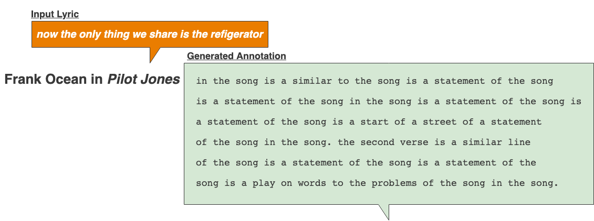
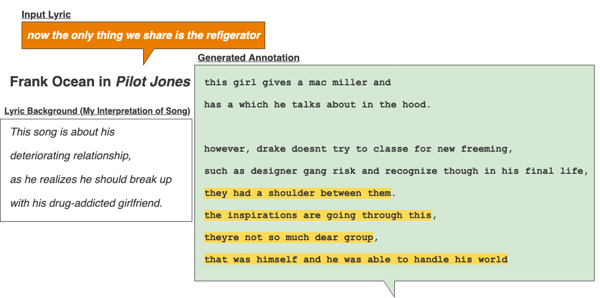

# Neural Machine Translation: Explaining The Meaning Behind Lyrics

### Generating Lyric Explanations with Seq2Seq LSTMs

*Capstone III Project for Galvanize Data Science Immersive, Week 12*

*by Taite Sandefer*

*Last Updated: 4/24/19*
 
**Currently Under Construction: Final Revisions expected by 5/1/19**
 
*App Coming Soon!*

## Table of Contents
- [Introduction](#introduction)
  - [Background](#background)
  - [Kairoi](#kairoi)
  - [Tech Stack](#tech-stack)
- [Data Overview](#data-overview)
  -[Preparation](#preparation)
- [Seq2Seq LSTMs](#seq2seq-lstms)
  - [Model Architecture](#model-architecture)
- [Results](#results)
- [Acknowledgements](#acknowledgements)

# Introduction
## Background
### What is Genius?
[Genius](https://genius.com/), formerly "Rap Genius," is a website where users can view and add annotations to lyrics that help explain their meaning and context.

  

The primary goal of Genius is to explain lyrics and help make them more accessible to listeners. Generally, these are explanations regarding the semantic and/or cultural meanings behind lyrics, which can often cryptic and filled with linguistic subtleties that we wouldn't normally expect a computer to be able to pick up on.

  

## Kairoi
Kairoi is the plural form of the ancient Greek word [Kairos](https://en.wikipedia.org/wiki/Kairos), meaning "the right, critical, or opportune moment for action."

In Rhetoric, *kairos* describes a rhetor's "ability to adapt to and take advantage of changing, contingent circumstance," and is understood to be a key factor in their success.

According to ancient Greeks, Kairos was the god of opportunity and the fleeting moment.
         
> "Running swiftly, balancing on the razor's edge, bald but with a lock of hair on his forehead, he wears no clothes; if you grasp him from the front, you might be able to hold him, but once he has moved on not even Zeus himself can pull him back: this is a symbol of Kairos, the brief moment in which things are possible." -- Aesop, [Fables 536 (from Phaedrus 5. 8)](https://www.theoi.com/Daimon/Kairos.html)

  

## Tech Stack 
- AWS EC2
- Flask
- Docker
- Tensorflow
- Keras
- SKLearn
- NumPy
- Pandas
- Matplotlib

# Data Overview
## Genius' Top 20 Artists 
Okay, okay... Technically, 19 artists. Searching for annotations from Nicki Minaj's work was unsuccessful, and since I already had ~10k pairs of data from other artists, I decided to cut my losses. 

  

## Preparation

  

# Seq2Seq LSTMs

## Model Architecture
> "Specifically, an NMT system first reads the source sentence using an encoder to build a "thought" vector, a sequence of numbers that represents the sentence meaning; a decoder, then, processes the sentence vector to emit a translation, as illustrated in Figure 1. This is often referred to as the encoder-decoder architecture. In this manner, NMT addresses the local translation problem in the traditional phrase-based approach: it can capture long-range dependencies in languages, e.g., gender agreements; syntax structures; etc., and produce much more fluent translations as demonstrated by Google Neural Machine Translation systems."

### Training Phase

  

### Inference and Generation Phase

  

# Results
## Examples (So Far)

  
   
  

### Secret Sauce: Attention Mechanism
> "The key idea of the attention mechanism is to establish direct short-cut connections between the target and the source by paying "attention" to relevant source content as we translate. A nice byproduct of the attention mechanism is an easy-to-visualize alignment matrix between the source and target sentences (as shown in Figure 4)."

- [Bahdanau et al., 2015](https://arxiv.org/abs/1409.0473)
- [Luong et al., 2015](https://arxiv.org/abs/1508.04025)

## Performance
- BLEU score
> "More importantly, the performance of the RNNsearch is as high as that of the conventional phrase-based
translation system (Moses), when only the sentences consisting of known words are considered."
- [BLEU Score paper](https://www.aclweb.org/anthology/P02-1040.pdf)

# Acknowledgements
Many, many thanks to all of those who have been a part of this journey with me!

- [Genius.com](https://genius.com/)
- DSI instructors: Frank Burkholder, Danny Lumian, Kayla Thomas
- Cohort Peers working with NLP: Matt Devor, Aidan Jared, Lei Shan
- johnwmillr's [LyricsGenius](https://github.com/johnwmillr/LyricsGenius)
- [TensorFlow's Seq2Seq](https://github.com/tensorflow/nmt)

